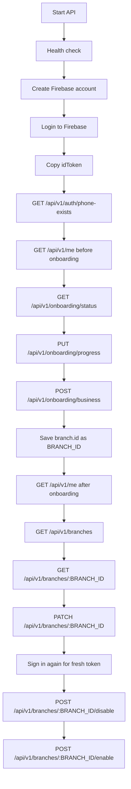

# FahamPesa API Testing Guide

For the complete current endpoint catalog, see `docs/api-reference.md`.
For the guided auth/onboarding and branch flow, see `docs/api-test-flow.md`.

## Variables

```json
{
  "BASE_URL": "http://localhost:4000",
  "FIREBASE_WEB_API_KEY": "<copy from Firebase Console Web app config>",
  "EMAIL": "owner@example.com",
  "PASSWORD": "StrongPassword123!",
  "ID_TOKEN": "<idToken from Firebase signup/login response>",
  "FRESH_ID_TOKEN": "<new idToken after signing in again>",
  "BRANCH_ID": "<branch.id from onboarding or branch list>"
}
```

## Request Flow



## Local Commands

For standalone local MongoDB, add this to `.env`:

```env
MONGODB_ALLOW_STANDALONE_WRITES=true
```

```powershell
npm.cmd run dev
```

```powershell
npm.cmd run build
npm.cmd test
```

## 1. Health Check

```json
{
  "method": "GET",
  "url": "http://localhost:4000/api/v1/health",
  "headers": {},
  "body": null
}
```

## 2. Create Firebase Account

```json
{
  "method": "POST",
  "url": "https://identitytoolkit.googleapis.com/v1/accounts:signUp?key=<FIREBASE_WEB_API_KEY>",
  "headers": {
    "Content-Type": "application/json"
  },
  "body": {
    "email": "owner@example.com",
    "password": "StrongPassword123!",
    "returnSecureToken": true
  }
}
```

Copy `idToken` from the response into `ID_TOKEN`.

## 3. Login To Firebase

```json
{
  "method": "POST",
  "url": "https://identitytoolkit.googleapis.com/v1/accounts:signInWithPassword?key=<FIREBASE_WEB_API_KEY>",
  "headers": {
    "Content-Type": "application/json"
  },
  "body": {
    "email": "owner@example.com",
    "password": "StrongPassword123!",
    "returnSecureToken": true
  }
}
```

Copy `idToken` from the response into `ID_TOKEN`. Sign in again later when a request needs `FRESH_ID_TOKEN`.

## 4. Public Phone Lookup

```json
{
  "method": "GET",
  "url": "http://localhost:4000/api/v1/auth/phone-exists?phone=%2B254700000000",
  "headers": {},
  "body": null
}
```

## 5. Get Session Before Onboarding

```json
{
  "method": "GET",
  "url": "http://localhost:4000/api/v1/me",
  "headers": {
    "Authorization": "Bearer <ID_TOKEN>"
  },
  "body": null
}
```

## 6. Get Onboarding Status

```json
{
  "method": "GET",
  "url": "http://localhost:4000/api/v1/onboarding/status",
  "headers": {
    "Authorization": "Bearer <ID_TOKEN>"
  },
  "body": null
}
```

## 7. Save Onboarding Progress

```json
{
  "method": "PUT",
  "url": "http://localhost:4000/api/v1/onboarding/progress",
  "headers": {
    "Authorization": "Bearer <ID_TOKEN>",
    "Content-Type": "application/json"
  },
  "body": {
    "currentStep": 3,
    "completedSteps": [1, 2],
    "skippedSteps": [],
    "data": {
      "personalProfile": {
        "fullName": "Owner User",
        "phoneNumber": "+254700000000"
      },
      "companyProfile": {
        "legalCompanyName": "Faham Test Shop Ltd",
        "registrationNumber": "C123456789"
      }
    }
  }
}
```

## 8. Onboard Business

```json
{
  "method": "POST",
  "url": "http://localhost:4000/api/v1/onboarding/business",
  "headers": {
    "Authorization": "Bearer <ID_TOKEN>",
    "Content-Type": "application/json"
  },
  "body": {
    "personalProfile": {
      "fullName": "Owner User",
      "phoneNumber": "+254700000000",
      "phoneVerified": true
    },
    "companyProfile": {
      "legalCompanyName": "Faham Test Shop Ltd",
      "registrationNumber": "C123456789"
    },
    "business": {
      "businessName": "Faham Test Shop",
      "businessType": "retail",
      "country": "Kenya",
      "currency": "KES"
    },
    "branch": {
      "name": "Main Branch",
      "location": {
        "address": "123 Test Street",
        "city": "Nairobi",
        "country": "Kenya"
      },
      "contact": {
        "phone": "+254700000000"
      },
      "branchCode": "MAIN",
      "branchType": "MAIN",
      "description": "Primary test branch",
      "currency": "KES"
    },
    "staffInvitations": [
      {
        "email": "manager@example.com",
        "role": "manager"
      }
    ]
  }
}
```

Save `data.branch.id` as `BRANCH_ID`.

## 9. Get Session After Onboarding

```json
{
  "method": "GET",
  "url": "http://localhost:4000/api/v1/me",
  "headers": {
    "Authorization": "Bearer <ID_TOKEN>"
  },
  "body": null
}
```

## 10. List Branches

```json
{
  "method": "GET",
  "url": "http://localhost:4000/api/v1/branches",
  "headers": {
    "Authorization": "Bearer <ID_TOKEN>"
  },
  "body": null
}
```

## 11. Get Branch

```json
{
  "method": "GET",
  "url": "http://localhost:4000/api/v1/branches/<BRANCH_ID>",
  "headers": {
    "Authorization": "Bearer <ID_TOKEN>"
  },
  "body": null
}
```

## 12. Update Branch

```json
{
  "method": "PATCH",
  "url": "http://localhost:4000/api/v1/branches/<BRANCH_ID>",
  "headers": {
    "Authorization": "Bearer <ID_TOKEN>",
    "Content-Type": "application/json"
  },
  "body": {
    "name": "Updated Branch Name",
    "description": "Updated branch description",
    "location": {
      "address": "456 Updated Street",
      "city": "Nairobi",
      "country": "Kenya"
    },
    "contact": {
      "phone": "+254711111111",
      "email": "branch@example.com"
    },
    "status": "active"
  }
}
```

## 13. Create Extra Branch

Free plan accounts should return `403 branch_limit_reached` because onboarding already creates the first active branch.

```json
{
  "method": "POST",
  "url": "http://localhost:4000/api/v1/branches",
  "headers": {
    "Authorization": "Bearer <ID_TOKEN>",
    "Content-Type": "application/json"
  },
  "body": {
    "name": "Second Branch",
    "location": {
      "address": "Second Branch Address",
      "city": "Nairobi",
      "country": "Kenya"
    },
    "contact": {
      "phone": "+254722222222"
    },
    "branchCode": "BR002",
    "branchType": "BRANCH",
    "description": "Second test branch",
    "currency": "KES",
    "openingHours": [
      {
        "dayOfWeek": "MONDAY",
        "isOpen": true,
        "openTime": "08:00",
        "closeTime": "17:00"
      }
    ],
    "taxSettings": {
      "chargeTax": false,
      "taxRate": 0,
      "taxNumber": ""
    }
  }
}
```

## 14. Disable Branch

Use a fresh token from a new Firebase login.

```json
{
  "method": "POST",
  "url": "http://localhost:4000/api/v1/branches/<BRANCH_ID>/disable",
  "headers": {
    "Authorization": "Bearer <FRESH_ID_TOKEN>"
  },
  "body": null
}
```

## 15. Enable Branch

```json
{
  "method": "POST",
  "url": "http://localhost:4000/api/v1/branches/<BRANCH_ID>/enable",
  "headers": {
    "Authorization": "Bearer <ID_TOKEN>"
  },
  "body": null
}
```

## Common Errors

```json
{
  "missing_auth_token": "Authorization bearer token is required",
  "invalid_auth_token": "Invalid authorization token",
  "business_already_exists": "User already has an active business membership",
  "branch_limit_reached": "Free plan allows only 1 active branch",
  "recent_reauth_required": "Sign in again and use the new idToken",
  "account_read_only": "Subscription or account status blocks writes"
}
```

Firebase Auth REST reference: https://firebase.google.com/docs/reference/rest/auth
